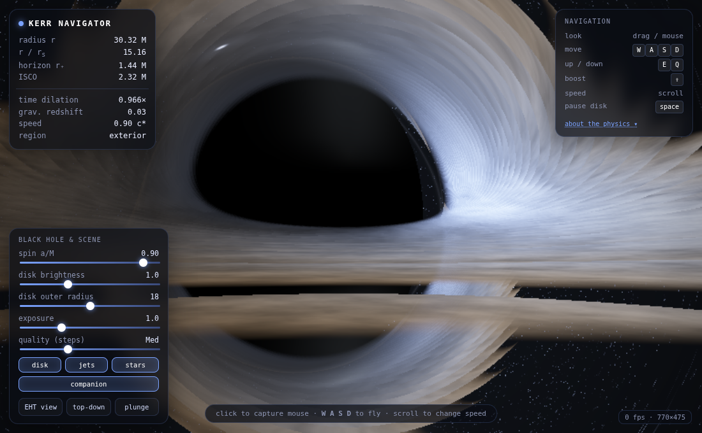

# Kerr — Black Hole Navigator

A real-time, physically-based **black hole flight simulator** that runs entirely in a web browser.
Open [`index.html`](index.html) and fly around, near, and *through* a rotating (Kerr) black hole.
Every frame is produced by **ray-tracing null geodesics through curved spacetime** on the GPU — the
bending of light, the shadow, the Einstein rings, the accretion-disk asymmetry, and the plunge
through the event horizon all emerge from the actual metric, not from a painted texture.



## Run it

Just open `index.html` in a recent **Chrome, Edge, Firefox, or Safari** (WebGL2 required). No build
step, no dependencies, no server — it's a single self-contained file. A discrete GPU is recommended;
use the **quality** slider to trade resolution/steps for framerate on weaker hardware.

## Controls

| Action | Input |
|---|---|
| Look around | click to capture the mouse, then move (or drag) |
| Fly | `W` `A` `S` `D` |
| Up / down (along spin axis) | `E` / `Q` |
| Boost | hold `Shift` |
| Change speed | scroll wheel |
| Pause disk rotation | `Space` |
| Presets | **EHT view**, **top-down**, **plunge** buttons |

The **HUD** (top-left) reads out your radius in gravitational radii `M` and Schwarzschild radii
`rₛ`, the horizon and ISCO radii, gravitational time dilation `dτ/dt`, redshift, and your region
(exterior → ergosphere → **inside the horizon**).

## The physics (what's actually being computed)

- **Metric.** The Kerr solution in **Kerr–Schild (Cartesian) coordinates**, `g_{μν} = η_{μν} + f
  lₘ lₙ`. Kerr–Schild is *horizon-penetrating*, which is what lets the camera and the light rays
  cross the event horizon smoothly — Boyer–Lindquist coordinates blow up there and can't.
- **Light transport.** For every pixel, a **null geodesic** is integrated backward from the eye with
  **RK4** and an adaptive step, using the Hamiltonian `H = ½ g^{μν} pₘ pₙ` (the conserved `p_t`
  reduces the work). Rays that fall inside `r₊ = M + √(M²−a²)` are captured → the black shadow; rays
  that escape sample the lensed sky.
- **Accretion disk.** A geometrically-thin, optically-thick equatorial disk between the **ISCO** and
  an adjustable outer radius. Material follows **prograde circular geodesics** (Keplerian `Ω`).
  Colour comes from the **redshift factor `g = E_obs/E_em`** — combining gravitational redshift and
  relativistic Doppler — applied to a **Shakura–Sunyaev** temperature profile (zero-torque inner
  boundary, so emission → 0 at the ISCO). Brightness includes **`g⁴` relativistic beaming**, which
  is why the approaching side is dramatically brighter — the signature look of the EHT image of M87*
  and of Interstellar's Gargantua.
- **Frame dragging & spin.** The `spin a/M` slider morphs from **Schwarzschild** (`a = 0`, perfectly
  symmetric shadow) to near-extremal **Kerr** (`a → 0.998`), shrinking the horizon, moving the ISCO,
  and skewing the shadow.
- **Sky.** A procedural multi-layer starfield + Milky-Way band + a lensed **companion star**, all
  sampled along each ray's *final* (bent) direction — so the background visibly warps and can form
  multiple images as you move.

Units are geometric: `G = c = M = 1`, distances in gravitational radii.

## Honest limitations

This is a physically-motivated real-time renderer, not a research GRMHD code. Known approximations:

- **Observer frame is approximate.** Initial ray momenta are built by lowering the screen direction
  with the spatial metric rather than constructing a full orthonormal tetrad from the observer's
  4-velocity, so relativistic **aberration** under fast camera motion isn't exact (the geodesic
  bending itself *is*).
- **Interior.** Kerr–Schild lets you cross the horizon, but rays are terminated near `r₊` — the true
  interior causal structure and the ring singularity are not rendered.
- **Disk** is a thin, single-scattering, optically-thick model; only the first couple of equatorial
  crossings contribute, so very high-order photon-ring subimages beyond the step budget aren't
  resolved.
- **Jets and the companion star** are illustrative emissive models, not an MHD simulation.
- Colour uses a chroma-normalised blackbody (hue is physical; absolute luminance is tone-mapped for
  display).

## Files

```
index.html   ← the entire simulator (HTML + WebGL2 GLSL + JS)
assets/      ← preview image
```
